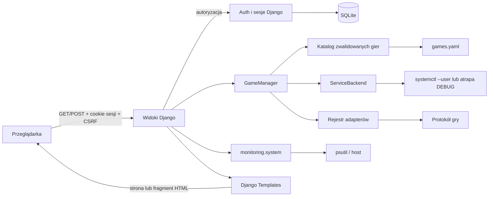

# Architektura aplikacji

Ten dokument opisuje aktualny kod panelu. [Plan implementacji](superpowers/plans/2026-09-27-game-servers-panel.md) jest zapisem pierwotnych etapów, a [ADR](decisions/README.md) wyjaśniają trwałe decyzje.

## Komponenty i granice

| Obszar | Odpowiedzialność | Główne moduły |
|---|---|---|
| Konfiguracja Django | Ustawienia, routing, SQLite, sesje i szablony | `config/` |
| Dostęp | Formularz tylko z hasłem, logowanie użytkownika `panel`, ochrona widoków i wylogowanie | `accounts/` |
| Katalog gier | Odczyt i walidacja `games.yaml`, definicje serwerów i lookup po slugu | `games/config.py`, `games/types.py` |
| Logika aplikacyjna gier | Połączenie katalogu, backendu usług i rejestru adapterów | `games/manager.py`, `games/factory.py` |
| Usługi | Interfejs `ServiceBackend`, realny `SystemdService` i lokalny `FakeSystemdService` | `games/services/` |
| Status gry | Rejestr i adaptery `generic`, `minecraft`, `a2s` | `games/status/` |
| HTTP i HTML | Dashboard, akcje POST, fragmenty HTMX i prezentacja błędów | `dashboard/`, `templates/` |
| Monitoring | Odczyt i normalizacja bieżących metryk hosta | `monitoring/` |
| Weryfikacja | Testy Django i bezpieczna kontrola repozytorium | `tests/`, `scripts/check.py` |

SQLite przechowuje standardowe dane Django, przede wszystkim konto auth i sesje. Nie ma modeli gry ani historii monitoringu. Definicje gier są w YAML. Ustawienia lokalne pochodzą z ignorowanego przez Git `.env` w katalogu projektu; zmienne środowiska procesu mają pierwszeństwo. Bootstrap i HTMX są dostarczone jako lokalne pliki w `static/vendor/`.

## Przepływ danych

Przeglądarka pobiera status każdej karty i metryki hosta przez osobne żądania HTMX z `hx-trigger="every 5s"`. Timer jest na stabilnym kontenerze; odpowiedź podmienia tylko fragment wewnętrzny. Formularze start/stop/restart wysyłają POST z tokenem CSRF i aktualizują kartę od razu po odpowiedzi. Interwał wynosi 5 s po stronie HTMX; przeglądarka może opóźniać żądania w tle.

## Kontrakt katalogu i sterowania

`games.yaml` zawiera mapę `games`. Każdy slug ma `name` i `service`, opcjonalnie `icon` oraz `status` (`type`, `host`, `port`, `timeout_s`). Loader odrzuca zduplikowane klucze, nieznane pola, niepoprawne slugi, nazwy usług, hosty i porty oraz duplikaty jednostek. Walidacja jest uruchamiana również przez Django system checks (`games.E001`). Szablon konfiguracji to [`games.example.yaml`](../games.example.yaml).

`GameManager` oferuje `get_servers`, `get_server`, `start`, `stop`, `restart`, `process_status`, `game_status`. Slug jest wyszukiwany w zwalidowanym katalogu; dopiero potem do backendu trafia nazwa usługi. `ServiceBackend` ma `start`, `stop`, `restart`, `status`. `SystemdService` używa krótkich wywołań `systemctl --user` przez `subprocess.run` z listą argumentów, `shell=False` i timeoutami (2 s dla statusu, 3 s dla akcji). Akcje z `--no-block` zlecają zadanie systemd; stan docelowy jest sprawdzany w kolejnych odczytach. Backend rozróżnia brak jednostki, timeout, niedostępność, odmowę, konflikt i nieprawidłową odpowiedź.

Stan procesu ma wartości `STOPPED`, `STARTING`, `RUNNING`, `STOPPING`, `FAILED`. Status gry jest niezależny: `ONLINE`, `OFFLINE`, `UNKNOWN`, `UNAVAILABLE` oraz opcjonalne dane, np. gracze i ping. Adaptery są rejestrowane w `games/status/registry.py`. Błąd adaptera daje `UNKNOWN`; brak konfiguracji adaptera nie blokuje akcji i daje `UNAVAILABLE` przy działającym procesie. Przy zatrzymanym lub uszkodzonym procesie widok nie odpytuje protokołu i pokazuje „Nie sprawdzano”.

`FakeSystemdService` jest dostępny wyłącznie przy `DEBUG=True` i trzyma stan w pamięci jednego procesu. Zmiany `games.yaml` wymagają ponownego uruchomienia procesu, ponieważ fabryka menedżera ma cache w obrębie procesu.

## HTTP i bezpieczeństwo

| Ścieżka | Metoda | Wynik |
|---|---|---|
| `/login/` | GET, POST | Formularz hasła i sesja Django |
| `/logout/` | POST | Wylogowanie |
| `/` | GET | Dashboard |
| `/servers/` | GET | Przekierowanie do dashboardu |
| `/servers/<slug>/status/` | GET | Fragment karty |
| `/servers/<slug>/{start,stop,restart}/` | POST | Fragment karty dla HTMX lub przekierowanie |
| `/system/stats/` | GET | Fragment metryk |

Wszystkie widoki panelu i fragmentów wymagają sesji; wygasła sesja HTMX powoduje przekierowanie przeglądarki do logowania przez `HX-Redirect`. Akcje zapisujące są POST i przechodzą przez standardową ochronę CSRF Django. Błędy usług są logowane, ale użytkownik dostaje ogólny komunikat. Dane z YAML i protokołów są escapowane przez Django Templates. `SECRET_KEY` jest wymagany w środowisku procesu lub lokalnym `.env`; wersjonowany szablon `.env.example` nie zawiera sekretu.

## Zależności zewnętrzne i ograniczenia

Realne sterowanie wymaga dostępnych dla procesu panelu istniejących usług `systemd --user` o nazwach wpisanych w YAML. Panel nie tworzy jednostek ani serwerów. Status protokołu może jeszcze być `UNKNOWN` po przejściu procesu do `RUNNING`, gdy gra nadal się uruchamia. Odczyt `psutil` jest bieżącą próbką; niedostępne metryki są pokazywane jawnie, bez zapisu historii. Produkcyjne proxy i serwer WSGI są poza kodem aplikacji.
